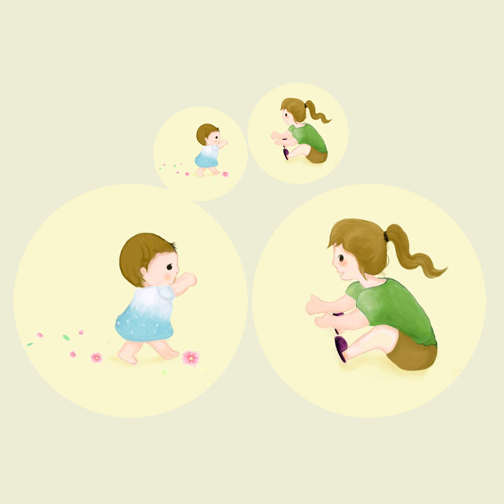

## Welcome to Baby Learns To Walk Record

I don't know if there is a cute baby in your family, but you must pay as much attention to your baby's life as I do. You'll be happy and excited when your baby learns to walk for the first time. You can record your baby's age and cute expressions as he learns to walk. Record whether the baby needs the help of the parent to complete the walk and so on. These precious memories can be recorded and Shared with family and friends so that your baby can grow up healthily.

If you have any questions, you can either leave a message or send the questions to our email address.

We will answer them for you in the first time.

### Address: jichungan9498@163.com

Thank you!
